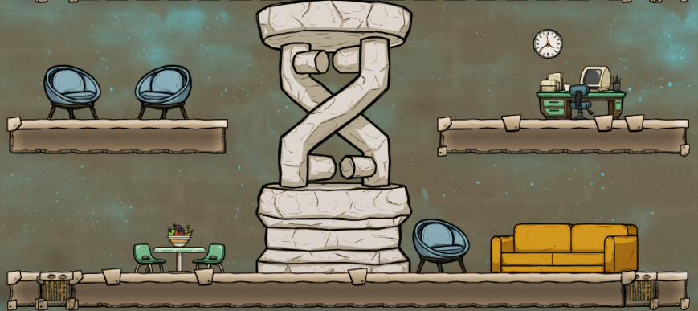

# Buildable POI Props

**BUILDING | DECOR**

## About
Allows building some decorative props that are in Points of Interest. Currently available: chairs, wall clock, computer desk, couch, gravitas monument, table with chairs. All buildings are in the **Furniture** category and require **Luxury** tech research.

### Chairs
**Constructed with:** 100 Plastic, 10 Reed Fiber  
**Decor:** +25, 4 tile radius

### Couch
**Constructed with:** 200 Plastic, 20 Reed Fiber  
**Decor:** +20, 4 tile radius

### DNA statue
**Constructed with:** 2000 Raw Mineral *(very slow to build)*  
**Decor:** +80, 7 tile radius

### Computer desk
**Constructed with:** 200 Steel   
**Decor:** +30, 6 tile radius

### Clock
**Constructed with:** 25 Plastic   
**Decor:** +5, 6 tile radius

### Table
**Constructed with:** 100 Plastic   
**Decor:** +25, 4 tile radius